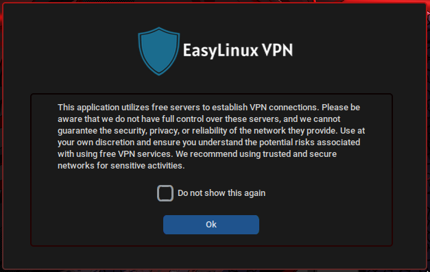
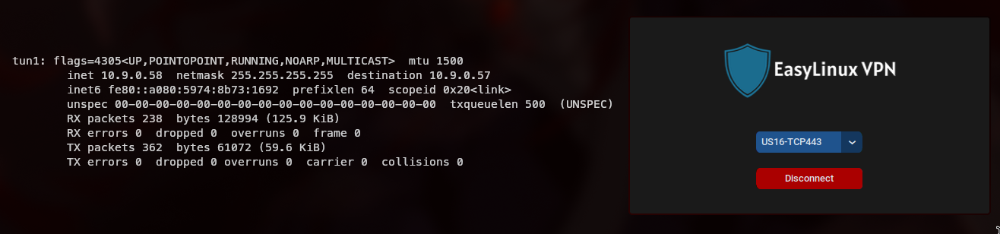

# EasyLinuxVPN
**EasyLinuxVPN** is a lightweight, user-friendly Linux application with a graphical interface that makes setting up and managing VPN connections via OpenVPN a breeze. No more terminal commands or complex configurations—just import your VPN files (ovpn/ folder) and connect, or use the default free servers provided to you!

# What are we doing?
**🔧 Easy Configuration:** Import .ovpn files and set up your VPN in seconds.

**🖱️ No Command-Line Needed:** Everything is handled via a clean graphical interface, ideal for users who prefer a simpler approach.




# Installing

1. Clone the repository:
```bash
git clone https://github.com/xeyossr/EasyLinux-VPN.git
cd EasyLinux-VPN
```

2. Copy your .ovpn files into the `ovpn` folder (Optional)

> [!WARNING]
> This application utilizes free servers to establish VPN connections. Please be aware that we do not have full control over these servers, and we cannot guarantee the security, privacy, or reliability of the network they provide. Use at your own discretion and ensure you understand the potential risks associated with using free VPN services. We recommend using trusted and secure networks for sensitive activities.

3. Run the application
```bash
./run.sh
```

# Prerequisites
Make sure you have OpenVPN and Python installed on your system. You can install it via your package manager:
```bash
# On Debian/Ubuntu-based distros
sudo apt install openvpn python3 python3-pip

# On RHEL-based distros
sudo dnf install openvpn python3 python3-pip

# On Arch-based distros
sudo pacman -S openvpn python python-pip
```

# Contribution
Found a bug? Have a cool feature request? Feel free to open an issue or a pull request. We welcome contributions of all kinds—just no pineapple on pizza, please.